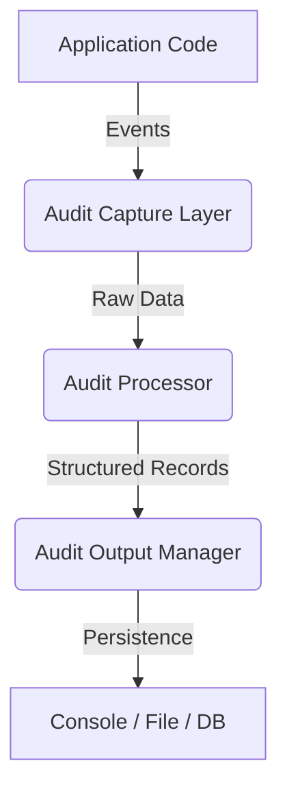

## Core Architecture

The `simpleaudit` library provides a lightweight, extensible framework for auditing Python applications. Its core architecture is designed around a modular pipeline that separates data collection, processing, and output generation. This separation allows developers to customize which data is captured, how it is transformed, and where it is stored without modifying the core engine.

### High-Level Data Flow

The auditing process follows a unidirectional data flow consisting of three primary stages:

1.  **Capture**: Interception of application events (e.g., function calls, HTTP requests, database queries).
2.  **Processing**: Transformation and enrichment of raw event data into structured audit records.
3.  **Output**: Serialization and persistence of audit records to various backends (console, file, database).



### Key Components

The architecture is built upon three core abstractions defined in the `simpleaudit.core` module:

#### 1. `AuditEvent`
The fundamental data structure representing a single auditable action. It encapsulates metadata about the event, such as the timestamp, user identity, and the specific action performed.

**Attributes:**
*   `timestamp` (datetime): The time the event occurred.
*   `actor` (str): The user or system component performing the action.
*   `action` (str): A descriptive string of the action (e.g., "user.login", "data.export").
*   `metadata` (dict): Arbitrary key-value pairs containing context-specific data.

#### 2. `AuditProcessor`
An abstract base class that defines the interface for transforming raw `AuditEvent` objects. Subclasses can implement logic to filter, enrich, or validate events before they are persisted.

**Key Methods:**
*   `process(event: AuditEvent) -> Optional[AuditEvent]`: Transforms the input event. If the event should be discarded (e.g., due to filtering rules), it returns `None`.

#### 3. `AuditOutput`
An abstract base class responsible for writing processed audit records to a destination.

**Key Methods:**
*   `write(record: AuditEvent)`: Persists the audit record.
*   `flush()`: Ensures all buffered data is written to the destination.

### The Audit Pipeline

The `AuditPipeline` class orchestrates the interaction between capture, processing, and output components. It maintains a list of processors and a list of outputs, applying them in sequence.

**Class: `AuditPipeline`**

| Parameter | Type | Description |
| :--- | :--- | :--- |
| `processors` | `List[AuditProcessor]` | A list of processors to apply in order. |
| `outputs` | `List[AuditOutput]` | A list of outputs to write to. |

**Methods:**
*   `add_processor(processor: AuditProcessor)`: Adds a processor to the pipeline.
*   `add_output(output: AuditOutput)`: Adds an output destination to the pipeline.
*   `emit(event: AuditEvent)`: Triggers the pipeline for a single event.

### Usage Example

The following example demonstrates how to set up a basic audit pipeline that logs all events to the console and filters out internal system actions.

```python
import simpleaudit
from simpleaudit.core import AuditEvent, AuditProcessor, AuditOutput
from simpleaudit.outputs import ConsoleOutput

# 1. Define a custom processor to filter internal actions
class InternalActionFilter(AuditProcessor):
    def process(self, event: AuditEvent):
        # Ignore events where the actor is 'system'
        if event.actor == 'system':
            return None
        return event

# 2. Define a custom output (or use built-in ConsoleOutput)
console_output = ConsoleOutput()

# 3. Initialize the pipeline
pipeline = simpleaudit.AuditPipeline(
    processors=[InternalActionFilter()],
    outputs=[console_output]
)

# 4. Emit an audit event
event = AuditEvent(
    actor="user123",
    action="document.download",
    metadata={"document_id": "doc_42", "ip_address": "192.168.1.5"}
)

pipeline.emit(event)
```

**Expected Output:**
```
[2023-10-27 10:00:00] user123: document.download | doc_id: doc_42, ip_address: 192.168.1.5
```

### Extending the Architecture

Developers can extend the architecture by implementing the `AuditProcessor` and `AuditOutput` interfaces. This allows for seamless integration with existing logging systems, SIEMs, or custom databases.

#### Custom Output Implementation

To send audit logs to a remote HTTP endpoint, implement the `AuditOutput` interface:

```python
import requests
from simpleaudit.core import AuditOutput, AuditEvent

class HttpAuditOutput(AuditOutput):
    def __init__(self, url: str):
        self.url = url

    def write(self, record: AuditEvent):
        payload = {
            "timestamp": record.timestamp.isoformat(),
            "actor": record.actor,
            "action": record.action,
            "metadata": record.metadata
        }
        try:
            requests.post(self.url, json=payload, timeout=5)
        except requests.RequestException as e:
            # Log error to stderr to avoid breaking the application
            print(f"Failed to send audit log: {e}", file=sys.stderr)

    def flush(self):
        pass # No buffering in this simple example
```

### Configuration

The `simpleaudit` library does not rely on external configuration files. All configuration is handled programmatically through the `AuditPipeline` constructor and its methods. This ensures that the auditing behavior is explicit and tied directly to the application's codebase.

### Best Practices

1.  **Order of Processors**: Processors are applied in the order they are added. Place filtering processors before enrichment processors to avoid unnecessary computation on discarded events.
2.  **Error Handling**: Implement robust error handling in custom `AuditOutput` classes. Auditing should never crash the main application.
3.  **Performance**: For high-throughput applications, consider implementing buffering in custom `AuditOutput` classes to reduce I/O operations.
4.  **Security**: Ensure that sensitive data (e.g., passwords, tokens) is not included in `AuditEvent` metadata. Use processors to sanitize data before it reaches the output stage.

By following this architecture, developers can create a robust, flexible, and maintainable auditing system that scales with their application's complexity.

### See Also

*   [Creating Custom Scenarios](creating-custom-scenarios.md)
*   [Getting Started](getting-started.md)
